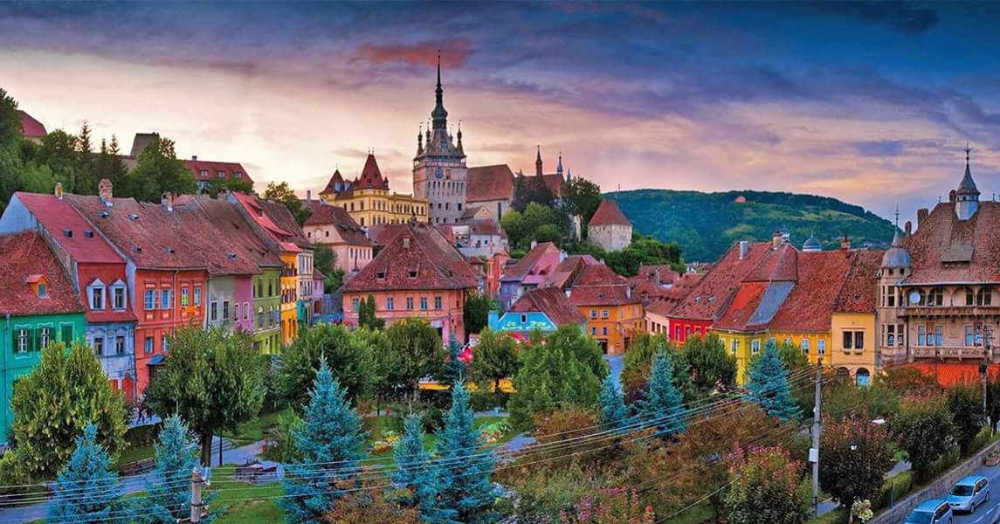

| [**Home**](../../index.md) |
[**Blogs**](../blogs/blog-list.md) |
[**About**](../about_Adrian.md) |
[**Legal**](../../legal/terms.md) |
[**Contact**](../contacts.md) |

<a href="../../index.md"><button style="color">Home</button></a>
<a href="./blog-list.md"><button style="color">Blogs</button></a>
<a href="../about_Adrian.md"><button style="color">About</button></a>
<a href="../../legal/terms.md"><button style="color">Legal</button></a>
<a href="../contacts.md"><button style="color">Contact</button></a>

# My Romania and myself

## Why Visit Romania?
Romania offers a diverse and enriching experience for travelers. Explore medieval castles, vibrant cities, and picturesque landscapes. Indulge in delicious cuisine, embrace cultural traditions, and witness the country's fascinating history. From the Carpathian Mountains to the Black Sea coast, Romania captivates with its authenticity, warmth, and a unique blend of old-world charm and modern vibrancy.

## Geography and climate

Romania is a country located in Southeastern Europe, bordering Bulgaria to the south, Serbia to the southwest, Hungary to the west, Ukraine to the north, and Moldova to the east. It also has a coastline along the Black Sea to the southeast.

## History of Romania:
* Ancient Period: Romania's history includes Dacian and Roman influences.
* Medieval Period: Wallachia and Moldavia emerged as principalities.
* Ottoman Rule: Romania experienced Ottoman influence for centuries.
Independence: Romania gained independence in 1877-1878.
* Communist Era: Communist rule ended with the 1989 revolution.
* Post-Communist Period: Romania joined the EU in 2007 and NATO in 2004.

## Culture: 
* Language: Romanian is the official language.
* Religion: Predominantly Eastern Orthodox.
* Folk Traditions: Rich in folk music, dance, and traditional celebrations.

* Literature and Arts: Notable writers and contributions to various art forms.
* Cuisine: Influenced by diverse cultures, with unique dishes.
>In summary, Romania has a history shaped by ancient civilizations, medieval principalities, and modern transitions. Its culture is marked by diverse traditions, language, and contributions to arts and literature.
## Government of Romania:
* Romania is a semi-presidential republic.
* Head of State: The President is elected by the people and serves a maximum of two five-year terms.
* Head of Government: The Prime Minister leads the government.
## Economy of Romania:
* Romania has a developing market economy.
* Key Industries: Information Technology, Automotive, and Agriculture are significant sectors.
* Challenges: Corruption has been a challenge, and infrastructure development is a focus.
* International Relations: Romania is a member of the European Union and engages in international trade.
>In summary, Romania has a semi-presidential republic government and a developing market economy with a focus on key industries. Challenges include corruption, and the country actively participates in international relations, particularly within the European Union.
## Society and Demographics:
* Population: Romania has a diverse population of over 19 million people.
* Ethnic Groups: Predominantly Romanian, with significant Hungarian and Roma minorities.
Language: Romanian is the official language.
* Religion: The majority follows Eastern Orthodoxy.
Urbanization: Urban and rural communities coexist, with major cities like Bucharest.
* Education: Romania has a well-established education system.
Healthcare: A mix of public and private healthcare services.
>In summary, Romania has a diverse population with a predominant Romanian majority. The society reflects a mix of ethnicities, languages, and cultural influences, with both urban and rural lifestyles. Education and healthcare are integral aspects of the country's social structure.

## Tourism and attractions:

>Romania is a country with a rich cultural and natural heritage, offering a diverse range of attractions for tourists. Here are some notable tourism highlights and attractions in Romania:

1. Bucharest - The Capital:
Palace of the Parliament: One of the largest administrative buildings globally, a symbol of the communist era.
Village Museum (Muzeul Satului): An open-air museum showcasing traditional Romanian village life.

2. Transylvania:
Bran Castle (Dracula's Castle): A medieval fortress associated with the Dracula legend.

3. Sibiu:
 A charming city with well-preserved medieval architecture, including the Council Tower and Brukenthal National Museum.

4. Cluj-Napoca: A vibrant city with a mix of historical and modern attractions.

5. Painted Monasteries of Northern Moldova:
Voroneț, Humor, and Moldovița Monasteries: UNESCO World Heritage Sites known for their unique frescoes and vibrant colors.

6. The Carpathian Mountains:
Transfăgărășan Highway: A stunning mountain road offering breathtaking views and access to Balea Lake.

7. Retezat National Park: A pristine natural reserve with diverse flora and fauna.

8. Black Sea Coast:
Constanta: A coastal city with Roman ruins, a vibrant seafront, and the Casino building.

9. Mamaia: A popular resort with sandy beaches and a lively nightlife.

10. Maramureș:
Wooden Churches of Maramureș: UNESCO-listed wooden churches known for their unique architectural style.

11. Merry Cemetery (Cimitirul Vesel): A colorful cemetery with elaborately carved and painted wooden crosses.

12. Danube Delta:
Unique Ecosystem: A UNESCO Biosphere Reserve, home to diverse wildlife and a paradise for birdwatching.

13. Sulina and Sfântu Gheorghe: Delta towns offering access to the river's channels and wildlife.

14. Sighișoara:
Medieval Citadel: A well-preserved medieval citadel, birthplace of Vlad the Impaler.

15. Peleș Castle:
Sinaia: A stunning Neo-Renaissance castle surrounded by the Carpathian Mountains.

16. Turda Salt Mine: An underground salt mine with chambers and tunnels.

17. Brasov:
Black Church (Biserica Neagră): A Gothic-style church in the heart of Brasov.

18. Rasnov Fortress: A medieval fortress offering panoramic views of the surrounding area.

>Romania's attractions span historical landmarks, natural wonders, and cultural treasures, making it a captivating destination for travelers. Whether you're interested in history, architecture, or the great outdoors, Romania has something to offer.

## Cuisine and food:

### Influences:
* Romanian cuisine is influenced by Balkan, Turkish, and Hungarian flavors.
Staples: Maize (corn), potatoes, and wheat are common staples.
### Dishes:
* Mămăligă: Polenta served with cheese and sour cream.
* Sarmale: Cabbage rolls stuffed with minced meat and rice.
* Mici: Grilled sausages, a popular street food.
### Desserts:
* Papanasi: Fried or boiled doughnuts served with sour cream and jam.
* Cozonac: Sweet bread with nuts, cocoa, or Turkish delight filling.
### Beverages:
* Tuica: Traditional plum brandy.
>Romanian cuisine is hearty, featuring a mix of meats, vegetables, and grains, with a variety of flavorful dishes and desserts.
## Contemporary Life and Trends in Romania:
* **Urbanization**: Increasing urban lifestyle with vibrant cities like Bucharest.
* **Technology**: Growing reliance on technology, with a rise in digital connectivity.
* **Cultural Events**: Active cultural scene with events, festivals, and exhibitions.
* **Cuisine Trends**: Embracing diverse culinary influences, including a focus on local and traditional ingredients.
* **Fashion**: Modern fashion trends influenced by both Western and traditional styles.
Sustainability: A rising awareness of environmental issues and sustainable practices.
* **Youth Culture**: Engaged youth culture participating in arts, music, and social movements.
>In summary, contemporary life in Romania reflects a blend of modern urban living, technological advancements, a rich cultural scene, and an increasing emphasis on sustainability.

## Challenges and Future Outlook of Romania:
### Challenges:

* **Corruption**: Addressing corruption remains a challenge.
* **Infrastructure**: Continued focus on improving infrastructure.
* **Economic Disparities**: Addressing regional economic disparities.
### Future Outlook:

* E**conomic Growth**: Potential for sustained economic growth.
Innovation: Embracing technological innovation.
* **EU Integration**: Further integration and collaboration within the European Union.
>In summary, Romania faces challenges in areas like corruption and infrastructure, but there's optimism for future economic growth, technological innovation, and strengthened ties with the European Union.

## Personal Stories and Experiences about my hometown, Sighisoara:

* Charming Atmosphere: Sighișoara's medieval charm is captivating. Cobblestone streets and colorful buildings create a unique ambiance.

*  Historical Impressions: Exploring the Clock Tower and Birthplace of Vlad the Impaler felt like stepping back in time. The history is palpable.

* Friendly Locals: Interactions with locals were warm. From sharing stories to recommendations, their friendliness enhanced the experience.

* Quaint Cafes: Enjoying coffee in the town square, surrounded by centuries-old architecture, added to the overall charm.

* Festival Vibe: Visiting during the Medieval Festival brought the town to life. Costumed performers and festivities made the trip memorable.

>In summary, Sighișoara leaves a lasting impression with its historical ambiance, friendly locals, and vibrant events.

## Resources and Further Reading about Romania:

### Websites:
1. [Official Tourism Website of Romania](https://www.romaniatourism.com/)
2. [Government of Romania Official Website](http://www.gov.ro/en)
3. [National Institute of Statistics - Romania](https://insse.ro/cms/en)
### Books:
1. "Romania: An Illustrated History" by Nicolae Klepper
2. "Balkan Ghosts: A Journey Through History" by Robert D. Kaplan
3. "Lost Enlightenment: Central Asia's Golden Age from the Arab Conquest to Tamerlane" by S. Frederick Starr
### Travel Guides:
1. "Lonely Planet Romania & Bulgaria" by Mark Baker and Chris Deliso
2. "DK Eyewitness Travel Guide: Romania" by DK Travel
### News Outlets:
1. [Romania Insider](https://www.romania-insider.com/)
2. [Adevarul](https://adevarul.ro/english)
>These resources provide a mix of official information, historical context, travel insights, and news coverage to help you explore and understand Romania further.

